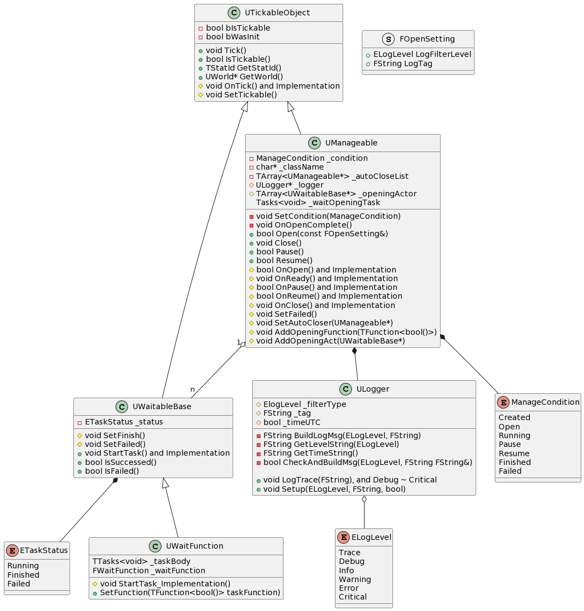
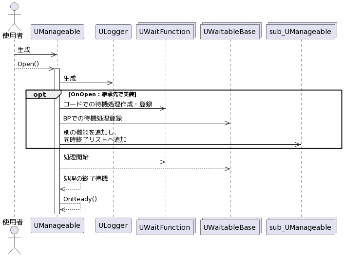
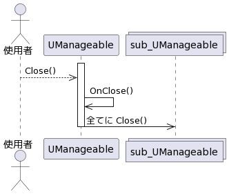

# ue_lib

# 機能

  
拡大は元画像（out/class/class.png）を使ってください

## Manageable
- 状態を管理できるクラス
  - 生成と処理の開始を明示的に分けることができる
  - 時間のかかる処理を待ってから処理の開始をすることが可能
### 基本的な使い方
1. 継承するクラスを作成し、各関数をオーバーライド
    - `OnOpen` : 初期化処理を実装する
      - 実行に必要な準備を非同期で開始する場合はそれを登録する
    - `OnReady` : 準備が完了し、動作が開始する直前の処理を実装する
      - 非同期での準備がない場合は OnOpen のあと直ぐに呼ばれる
    - `OnPause` : 一時停止する際の処理を実装する
    - `OnResume` : 一時停止から復帰する際の処理を実装する
    - `OnClose` : 終了時の後処理を実装する
    - コードで実装する場合は `_Implementation` がついた関数をオーバーライドする
2. オブジェクトを生成し、 `Open` を実行する
3. 終了時は `Close` を呼ぶ

  

### WaitableBase
- 処理が終わったかどうかを明示させるクラス
  - 処理の開始時に `StartTask` が呼ばれる
    - コードの場合は `StartTask_Implementation` 
  - 処理が成功したら `SetFinish` を呼ぶ
    - 失敗時は `SetFailed`
## Logger
- ログ機能のラップ
- ログレベルや時刻を入れたログを出力する
  - 特定レベル未満のログをフィルタリングする機能あり
- `LogInfo` 等でログレベルに応じたログを出力できる

## ActionReplay
- 数値やベクトルをファイルに書き出したりそれを再生する機能
  - オブジェクトとそれをラップする ActorComponent が準備されている
- データと経過時間を記録するため、記録時と同じタイミングでデータが再生される
### 使用方法
- オブジェクトやコンポーネントを作成or追加する
  - オブジェクトの場合は生成後に `Open` を呼ぶ
- 記録関数の呼び出しや読み込みイベントからデータの取り出しをする
#### 初期設定
- オブジェクトの生成ノードやコンポーネントのインスペクタで以下の設定をする
  - `ReplayMode` : 記録か再生かを選択する
    - `Invalid` はどちらの動作もしない
  - `ReplayLogname` : 読み書きするファイル名
    - 同一ファイルへの書き込みは上書きとなる
    - ファイルは Saved/ActionRecord に保存される
#### データの保存
- `Save***` を実行して保存する
  - *** は型に応じたものにする（`Bool`, `Int32`, `Float`, `Vector`）
- `Action` はどういったデータなのかの識別用タグ
- `Force` は必ず記録させるフラグ
  - データの肥大化を避けるため同一データは記録しないようにしているため、このフラグで同一データでも記録できるようになる
#### データの読み込み
- 型ごとにイベントが定義されているためそれで取得する
  - イベント名は `On***Record`
- コンポーネントの場合はインスペクタからのイベント作成が可能

# 不具合等
## 全般
- [ ] メンバ変数をパスカルケースに
## Manageable
- [x] ログのタグのデフォルトがクラス名を入れているが継承先でも基底の `UManageable` になる
## ActionReplay
- [ ] ファイルポインタを直接使っている

# 今後作りたい機能
- [ ] テキストやバイナリのファイルをアセットとして扱えるようにする
- [ ] ウィジェットの Manageable 化
- [ ] ステートマシン
