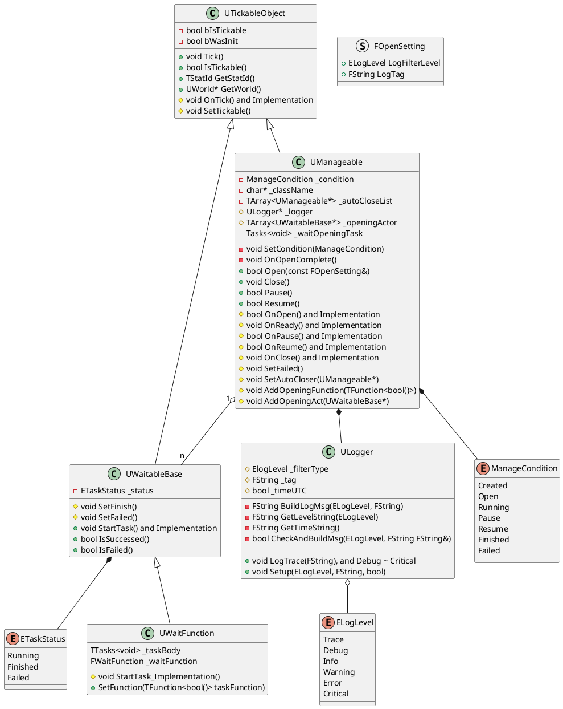
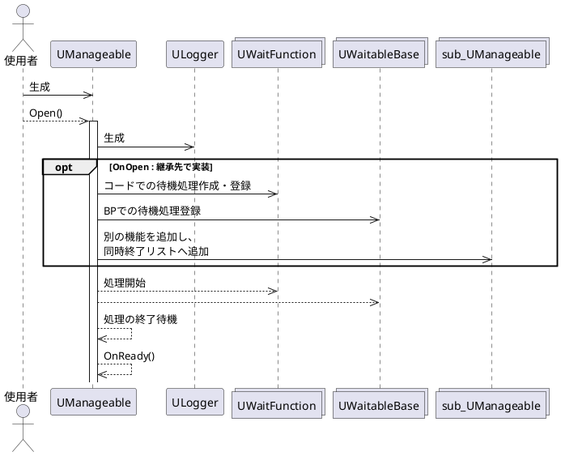
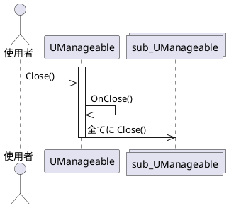

```puml
@startuml class
class UTickableObject{
    - bool bIsTickable
    - bool bWasInit
    + void Tick()
    + bool IsTickable()
    + TStatId GetStatId()
    + UWorld* GetWorld()
    # void OnTick() and Implementation
    # void SetTickable()
}

enum ELogLevel{
    Trace
    Debug
    Info
    Warning
    Error
    Critical
}

class ULogger{
    # ElogLevel _filterType
    # FString _tag
    # bool _timeUTC

    - FString BuildLogMsg(ELogLevel, FString)
    - FString GetLevelString(ELogLevel)
    - FString GetTimeString()
    - bool CheckAndBuildMsg(ELogLevel, FString FString&)

    + void LogTrace(FString), and Debug ~ Critical
    + void Setup(ELogLevel, FString, bool)
}
ULogger o-- ELogLevel

enum ETaskStatus{
    Running
    Finished
    Failed
}

class UWaitableBase{
    - ETaskStatus _status

    # void SetFinish()
    # void SetFailed()
    + void StartTask() and Implementation
    + bool IsSuccessed()
    + bool IsFailed()
}
UTickableObject <|-- UWaitableBase
UWaitableBase *-- ETaskStatus

class UWaitFunction{
    TTasks<void> _taskBody
    FWaitFunction _waitFunction

    # void StartTask_Implementation()
    + SetFunction(TFunction<bool()> taskFunction)
}
UWaitableBase <|-- UWaitFunction

enum ManageCondition{
    Created
    Open
    Running
    Pause
    Resume
    Finished
    Failed
}

struct FOpenSetting {
    + ELogLevel LogFilterLevel
    + FString LogTag
}

class UManageable {
    - ManageCondition _condition
    - char* _className
    - TArray<UManageable*> _autoCloseList
    # ULogger* _logger
    # TArray<UWaitableBase*> _openingActor
    Tasks<void> _waitOpeningTask

    - void SetCondition(ManageCondition)
    - void OnOpenComplete()
    + bool Open(const FOpenSetting&)
    + void Close()
    + bool Pause()
    + bool Resume()
    # bool OnOpen() and Implementation
    # void OnReady() and Implementation
    # bool OnPause() and Implementation
    # bool OnReume() and Implementation
    # void OnClose() and Implementation
    # void SetFailed()
    # void SetAutoCloser(UManageable*)
    # void AddOpeningFunction(TFunction<bool()>)
    # void AddOpeningAct(UWaitableBase*)
}
UTickableObject <|-- UManageable
UManageable *-- ManageCondition
UManageable "1" o-- "n" UWaitableBase
UManageable *-- ULogger


@enduml
```

```puml
@startuml manageable_open
actor 使用者 as user
participant UManageable as man
participant ULogger as log
collections UWaitFunction as wf
collections UWaitableBase as wb
collections sub_UManageable as sm

user->>man:生成
user-->>man:Open()
activate man
    man->>log:生成
    opt OnOpen : 継承先で実装
        man->>wf:コードでの待機処理作成・登録
        man->>wb:BPでの待機処理登録
        man->>sm:別の機能を追加し、\n同時終了リストへ追加
    end
    man-->>wf:処理開始
    man-->>wb:
    man-->>man:処理の終了待機
    man-->>man:OnReady()
@enduml
```

```puml
@startuml manageable_close
actor 使用者 as user
participant UManageable as man
collections sub_UManageable as sm

activate man
    user-->>man:Close()
    man->>man:OnClose()
    man->>sm:全てに Close()
deactivate man
@enduml
```
